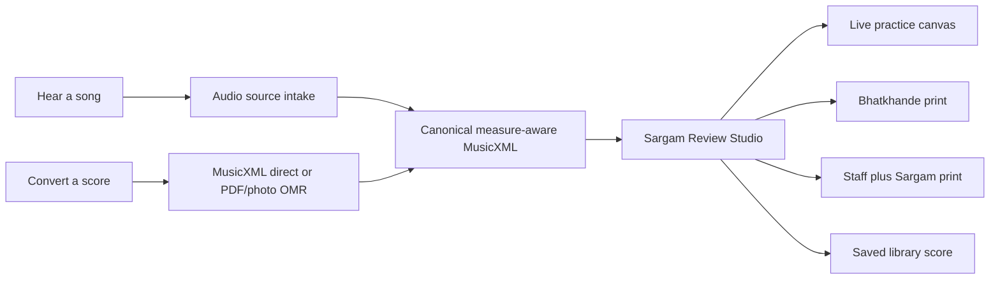

# Unified score experience

## Product promise

Sargam.io gives an Indian musician one consistent practice experience whether
they start from a recording, a digital score, or a photographed staff page:

`source -> verified musical score -> relative Sargam -> practice -> print -> library`

The canonical internal artifact is a measure-aware `MusicXML` score plus the
user's selected Sa. Every visualizer, notation toggle, practice mode, and PDF
export reads from that same artifact. This prevents separate, drifting versions
of a song for keyboard, bansuri, print, and playback.

## Two entry points, one studio

### Hear a song

The user chooses **Transcribe a recording**, uploads audio they are authorized
to use, and selects whether they want the main melody, a lead sheet, or a
specific stem. An audio-transcription job produces MIDI/MusicXML and timing;
the job then enters the same Review Studio.

Do not promise arbitrary YouTube extraction in the public product until we
have a rights-cleared acquisition policy. A URL can be used for metadata or a
user-authorized source only when the applicable platform, copyright, and vendor
terms allow it.

### Convert a score

The user chooses **Upload MusicXML, PDF, or photo**.

1. MusicXML/MXL bypasses recognition and enters validation immediately.
2. PDF/photo creates an asynchronous OMR job with provider progress.
3. The user sees detected title, parts, meter, and a clear `Review required`
   state whenever the validator finds a timing, tie, or voice warning.
4. A valid score enters the same Review Studio as an audio-derived score.

## Review Studio

The studio is the product's centre, not a post-processing modal. Its controls
apply instantly to playback and print:

| Control | User result | Data rule |
| --- | --- | --- |
| `Choose Sa` | D=Sa, F=Sa, etc. | A presentation/transposition choice; source pitches remain preserved. |
| `Notation` | Roman Sargam by default; Devanagari or pitch names on demand | A token renderer, never a second transcription. |
| `Taal` | Adds Sam, Khali, Tali and vibhag guidance | Explicit user/curator choice; never guessed only from Western meter. |
| `Instrument` | Keyboard, harmonium, bansuri, sitar, guitar practice surfaces | Reads the canonical note timeline. |
| `Practice` | Metronome, drone, tempo loop, falling notes and live feedback | Reads the same timing data used by print. |

## Two print products

### Bhatkhande practice print - first ship

This is the existing compact, Roman-Sargam-default PDF. It uses continuous
swara lines, close intra-matra spacing, sustain marks, and bar/vibhag dividers
without a Western cell grid. When an explicit tala exists, it can show `X`,
`0`, and tali markers; otherwise it preserves the source meter without
inventing a tala.

### Western staff with Sargam annotations - second print mode

The user sees standard staff notation with the selected Sargam token printed
near each notehead, in Roman by default and Devanagari on demand. Ship this in
two honest stages:

1. **Re-engraved staff PDF:** render a clean staff from the canonical
   MusicXML and attach Sargam annotations. This is reliable and is the first
   production version.
2. **Original-PDF overlay:** only offer this when the OMR/provider supplies a
   trustworthy coordinate mapping from each recognized note to the original
   PDF. MusicXML alone does not reliably preserve original PDF coordinates;
   guessing positions would put text on the wrong note.

## Provider roles

| Need | Preferred provider | Why | Boundary |
| --- | --- | --- |
| PDF/photo -> MusicXML/MIDI | Flat OMR / Opuscan | Job API, progress, optional review, MusicXML/MIDI output | API is Beta; contract, DPA, retention, and benchmark required. |
| PDF/photo fallback | ScoreFlow | Public asynchronous API, MusicXML/MIDI output and documented per-page credits | Needs a quality, security, and support benchmark. |
| Audio -> MIDI/MusicXML | Klangio | Transcription, beat tracking, source separation, MIDI/MusicXML job output | Need commercial quote, Indian-repertoire benchmark, and rights policy. |
| Audio stem preparation | Moises Developer Platform | Stem separation before melody extraction | It separates stems; it is not the score-transcription provider. |

## Product state machine

`draft -> uploading -> queued -> processing -> validating -> review-required | ready -> saved | failed`

The front end never waits on a long request. It shows a live job card with
source type, provider-neutral status, current page/step when available, credit
use, retry/cancel actions, and an honest review notice before any score is
saved to the library.

## What must happen before production launch

1. Get a written SaaS/DPA/retention quote from Flat and Klangio; do not enter
   customer audio or scores into a personal trial account.
2. Benchmark both providers on a rights-cleared set including Indian melody,
   Bollywood arrangements, accidentals, ties, 3/4 and 4/4 scores, and lower
   quality phone captures.
3. Add durable job, file, score, score-version, export, and credit records.
4. Build the review studio before automatic public library publishing.
5. Add the re-engraved `staff + Sargam` PDF, then evaluate coordinate-based
   original-PDF overlays.

## Source material

- [Flat OMR Jobs API](https://flat.io/developers/docs/api/omr/)
- [ScoreFlow API](https://scoreflow.app/api-docs)
- [Klangio transcription API](https://api.klang.io/open_api)
- [Moises stem-separation API](https://developer-legacy-stage.moises.ai/docs/media/stems-separation)
